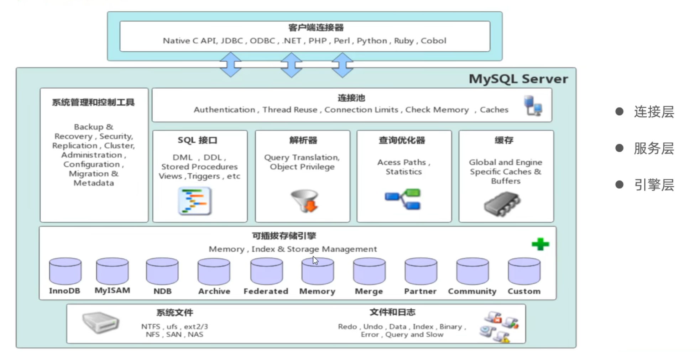

# Mysql体系结构与存储引擎
## Mysql的体系结构
1. 连接层：
   ```text
   完成一些类似于连接处理、授权认证、及相关的安全方案。
   ```
2. 服务层
   ```text
   Mysql的核心。所有的跨存储引擎的功能都在这一层实现。
   管理服务与工具：提供数据库的备份与恢复、复制、集群管理等基础服务。
   SQL接口（SQL Interface）：接收客户端发送的SQL命令（如SELECT, INSERT, UPDATE, DELETE），并返回处理结果。
   
   ```
   