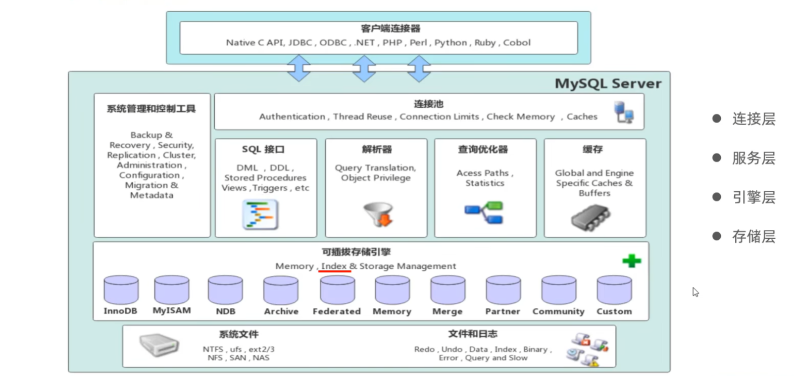

# Mysql体系结构与存储引擎
## Mysql的体系结构
分层与可插拔  

### 连接层
   完成一些类似于连接处理、授权认证、及相关的安全方案。
### 服务层
1. Mysql的核心。所有的**跨存储引擎的功能**都在这一层实现。  
2. 管理服务与工具：提供数据库的备份与恢复、复制、集群管理等基础服务。  
3. SQL接口（SQL Interface）：接收客户端发送的SQL命令（如SELECT, INSERT, UPDATE, DELETE），并返回处理结果。    
4. 解析器（Parser）：  
   &ensp;&ensp;&ensp;&ensp;语法解析：检查SQL语句是否符合MySQL的语法规则。  
   &ensp;&ensp;&ensp;&ensp;语义解析：检查表名、列名等是否存在和有效。  
   &ensp;&ensp;&ensp;&ensp;生成解析树：将SQL语句解析成一个内部的数据结构（解析树）。 
5. 优化器（Optimizer）：
   &ensp;&ensp;&ensp;&ensp;它对解析树进行优化。  
   &ensp;&ensp;&ensp;&ensp;决定使用哪个索引。  
   &ensp;&ensp;&ensp;&ensp;决定多表的连接顺序（如先查A表还是先查B表）。    
   &ensp;&ensp;&ensp;&ensp;生成它认为最优的执行计划（Execution Plan）。    
6. 查询缓存（Query Cache, MySQL 8.0 已移除）：
### 存储引擎层（Pluggable Storage Engines）
1. MySQL 的一个关键特性是**可插拔的存储引擎**。
2. 服务层是通用的，而底层的数据存储和提取方式由不同的引擎实现。
3. **存储引擎是表级的，不是针对于数据库的**。
### 存储层
1. 表数据文件：存储**数据库表和索引数据**的核心文件。.ibd 文件、ibdata1 文件  
2. 日志文件（Log Files）：   
   &ensp;&ensp;&ensp;&ensp;重做日志（Redo Log）：保证**持久性**。记录的是对数据页的物理修改。当事务提交时，只需先写入Redo Log（顺序写，速度快），无需立即将数据页刷盘。即使数据库崩溃，重启后也能根据Redo Log重做已提交但未落盘的操作。Write-Ahead Logging 策略。  
   &ensp;&ensp;&ensp;&ensp;撤销日志（Undo Log）：记录了事务发生前的数据旧版本。用于实现**事务回滚**和**MVCC**。
   &ensp;&ensp;&ensp;&ensp;二进制日志（Binlog）:Server层记录的日志。记录的是**引起数据变更的SQL语句或行数据变更**。主要用于**主从复制**和**数据恢复**。
3. 其他重要文件：  
   &ensp;&ensp;&ensp;&ensp;慢查询日志：记录执行时间超过指定阈值的SQL语句。  
   &ensp;&ensp;&ensp;&ensp;错误日志：记录MySQL启动、运行、停止过程中的诊断信息和错误信息。  
   &ensp;&ensp;&ensp;&ensp;中继日志：在从库上使用，用于主从复制。  